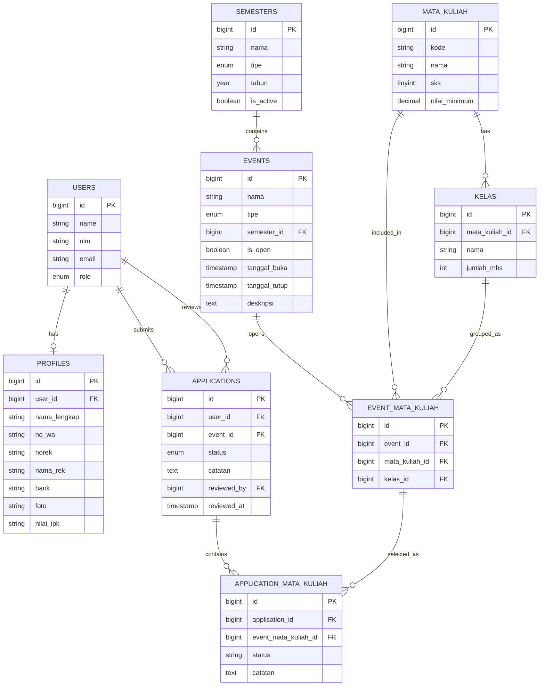

# Dokumentasi Aplikasi Silabku

## 1. Ringkasan

Silabku pada repo ini adalah aplikasi rekrutmen dan pengelolaan asisten berbasis:

- Laravel 12 sebagai backend utama
- Inertia.js sebagai penghubung backend dan frontend
- React + TypeScript sebagai frontend
- Laravel Sanctum untuk token API
- Tailwind CSS dan komponen UI React untuk tampilan

Domain utama aplikasi berfokus pada:

- pengelolaan periode semester
- master data mata kuliah dan kelas
- pembukaan event rekrutmen asisten
- pendaftaran mahasiswa ke event
- proses seleksi per pilihan mata kuliah
- penyimpanan database asisten yang sudah disetujui

Dokumen ini disusun berdasarkan implementasi aktual pada route, controller, model, migration, middleware, dan halaman frontend yang ada di repo saat ini.

### Dokumen pendukung kebutuhan (untuk laporan)

Untuk artefak tahap **identifikasi kebutuhan sistem** (daftar FR/NFR terukur, flow proses, wireframe), lihat:

- `docs/identifikasi-kebutuhan-sistem.md`

---

## 2. Arsitektur Aplikasi

### 2.1 Arsitektur teknis

Aplikasi menggunakan pola hybrid:

- **Web route Laravel** untuk merender halaman Inertia
- **API route Laravel** untuk seluruh operasi data bisnis
- **Frontend React** memanggil API `/api/*` menggunakan Axios

Secara sederhana, alurnya:

1. User membuka URL web seperti `/dashboard`, `/admin/events`, atau `/oprec/events`.
2. Laravel route pada `routes/web.php` mengembalikan halaman Inertia.
3. Frontend React yang dirender oleh Inertia akan memanggil API backend seperti `/api/events`, `/api/applications`, atau `/api/profile`.
4. Backend memproses validasi, business rule, relasi model, dan menyimpan data ke database.
5. Frontend menampilkan hasilnya ke user.

### 2.2 Komponen utama

#### Backend

- **Route web**
  - menangani halaman Inertia
  - berada di `routes/web.php`, `routes/auth.php`, `routes/settings.php`
- **Route API**
  - menangani data aplikasi
  - berada di `routes/api.php`
- **Controller**
  - mengelola logika domain seperti semester, mata kuliah, kelas, event, profil, dan aplikasi
- **Model Eloquent**
  - memetakan tabel database dan relasi antar tabel
- **Migration**
  - mendefinisikan struktur tabel dan constraint database
- **Middleware**
  - membatasi akses berdasarkan autentikasi dan role

#### Frontend

- **Inertia page**
  - halaman role-based seperti admin, mahasiswa, seleksi, dan database asisten
- **Axios client**
  - file `resources/js/lib/api.ts`
  - otomatis mengirim Bearer token dari `localStorage`
- **Layout dan sidebar**
  - menu berbeda tergantung role user

### 2.3 Pola autentikasi

Autentikasi aplikasi berjalan dalam dua lapisan:

- **Session auth Laravel** untuk akses halaman web/Inertia
- **Token Sanctum** untuk pemanggilan API dari frontend React

Saat user sudah login, middleware `HandleInertiaRequests` akan:

- memuat data `auth.user`
- memuat relasi `profile`
- membuat token Sanctum bila sesi belum punya `auth_token`
- mengirim token itu ke frontend melalui shared props Inertia

Frontend kemudian menyimpan token tersebut di `localStorage`, lalu setiap request Axios ke `/api` mengirim header:

```http
Authorization: Bearer <token>
```

### 2.4 Middleware dan kontrol akses

Middleware utama yang dipakai:

- `auth`
  - user harus login
- `verified`
  - user harus verifikasi email sebelum mengakses area utama
- `role:admin`
  - khusus admin
- `role:admin,dosen`
  - khusus admin dan dosen

Implementasi role dicek melalui `RoleMiddleware`, yang membandingkan `user()->role` dengan daftar role yang diizinkan.

### 2.5 Struktur navigasi berdasarkan role

Sidebar aplikasi dibangun dinamis sesuai role:

- **Mahasiswa (`user`)**
  - Dashboard
  - Profil Asisten
  - Event Terbuka
  - Pendaftaran Saya
  - Database Asisten
- **Admin**
  - Dashboard
  - Kelola Semester
  - Kelola Mata Kuliah
  - Kelola Kelas
  - Kelola Event
  - Seleksi Asisten
  - Database Asisten
- **Dosen**
  - Dashboard
  - Seleksi Asisten
  - Database Asisten

---

## 3. Peran Pengguna dan Modul

### 3.1 Mahasiswa / User

Fokus role ini adalah mendaftar sebagai calon asisten.

Modul yang dipakai:

- profil asisten
- daftar event terbuka
- form pendaftaran
- riwayat pendaftaran
- database asisten

### 3.2 Admin

Fokus role ini adalah menyiapkan struktur rekrutmen dan memantau hasilnya.

Modul yang dipakai:

- semester
- mata kuliah
- kelas
- event recruitment
- seleksi asisten
- database asisten

### 3.3 Dosen

Fokus role ini adalah membantu proses seleksi.

Modul yang dipakai:

- seleksi asisten
- database asisten

### 3.4 Semua user login

Semua user yang sudah login dan terverifikasi dapat mengakses:

- dashboard
- settings profile
- settings password
- settings appearance
- database asisten

Catatan: dashboard saat ini masih berupa placeholder visual.

---

## 4. Flow Aplikasi End-to-End

### 4.1 Flow umum

1. User membuka halaman awal `/`.
2. User melakukan register atau login.
3. Setelah login dan email terverifikasi, user masuk ke `/dashboard`.
4. Menu sidebar akan menyesuaikan role user.
5. User melanjutkan ke flow sesuai kewenangannya.

### 4.2 Flow mahasiswa

### Langkah 1: Melengkapi profil asisten

Mahasiswa masuk ke halaman `/profil`.

Data yang dapat diisi:

- nama lengkap
- nomor WhatsApp
- nomor rekening
- nama pemilik rekening
- nama bank
- nilai IPK
- foto profil

Data ini penting karena dipakai untuk:

- validasi kelayakan pendaftaran
- keperluan verifikasi
- kontak asisten
- kebutuhan pembayaran

### Langkah 2: Melihat event recruitment terbuka

Mahasiswa membuka `/oprec/events`.

Frontend memanggil API:

- `GET /api/applications/open-events`

Backend mengembalikan:

- event yang `is_open = true`
- semester event
- daftar mata kuliah dan kelas yang dibuka di event
- kuota asisten per kelas
- jumlah asisten approved saat ini per pilihan event-mata_kuliah

### Langkah 3: Membuka detail form pendaftaran

Mahasiswa masuk ke `/oprec/apply/{eventId}`.

Frontend memanggil:

- `GET /api/events/{event}`

Data yang ditampilkan:

- detail event
- daftar kombinasi mata kuliah dan kelas yang tersedia
- daftar asisten yang sudah approved
- application milik user pada event tersebut bila sudah pernah mendaftar

### Langkah 4: Validasi sebelum submit

Sebelum submit, sistem memeriksa:

- event masih terbuka (`is_open = true`)
- user sudah mengisi profil minimal
- user memilih minimal satu mata kuliah-kelas
- IPK user memenuhi `nilai_minimum` untuk setiap mata kuliah yang dipilih

Jika IPK kurang dari syarat minimum sebuah mata kuliah, submit akan ditolak.

### Langkah 5: Submit pendaftaran

Frontend mengirim:

- `POST /api/applications/apply`

Isi data utama:

- `event_id`
- `event_mata_kuliah_ids[]`

Logika backend:

1. Cari event.
2. Pastikan event terbuka.
3. Cek apakah user sudah punya application untuk event tersebut.
4. Jika belum ada, buat 1 record di `applications`.
5. Tambahkan pilihan ke `application_mata_kuliah` untuk setiap `event_mata_kuliah_id`.
6. Hindari duplikasi pilihan yang sama.

Satu mahasiswa hanya boleh punya **satu application per event**, tetapi application itu bisa punya **banyak pilihan mata kuliah-kelas**.

### Langkah 6: Melihat status pendaftaran

Mahasiswa membuka `/oprec/my-applications`.

Frontend memanggil:

- `GET /api/applications/my`

Yang ditampilkan:

- event yang diikuti
- semester event
- status utama application
- status tiap pilihan mata kuliah
- catatan per pilihan
- catatan global application bila ada

### 4.3 Flow admin menyiapkan recruitment

### Langkah 1: Menyiapkan semester

Admin membuka `/admin/semesters`.

Admin bisa:

- tambah semester
- edit semester
- hapus semester

Field utama:

- nama semester
- tipe: `gasal` atau `genap`
- tahun
- status aktif

### Langkah 2: Menyiapkan master mata kuliah

Admin membuka `/admin/mata-kuliah`.

Admin bisa:

- tambah mata kuliah
- edit mata kuliah
- hapus mata kuliah

Field utama:

- kode
- nama
- sks
- nilai minimum/IPK minimum

### Langkah 3: Menyiapkan kelas

Admin membuka `/admin/kelas-list`.

Admin bisa:

- tambah kelas untuk mata kuliah tertentu
- edit kelas
- hapus kelas

Field utama:

- mata kuliah
- nama kelas
- jumlah mahasiswa

Kuota asisten **tidak disimpan di database**, tetapi dihitung dengan rumus:

```text
ceil(jumlah_mhs / 8)
```

### Langkah 4: Membuat event recruitment

Admin membuka `/admin/events`.

Admin bisa:

- membuat event
- mengubah detail event
- membuka atau menutup pendaftaran
- menghapus event

Field utama event:

- nama event
- tipe: `praktikum` atau `tutorial`
- semester
- status buka/tutup
- tanggal buka
- tanggal tutup
- deskripsi

### Langkah 5: Mengaitkan mata kuliah dan kelas ke event

Admin membuka detail event di `/admin/events/{id}`.

Pada halaman ini admin bisa:

- melihat daftar mata kuliah-kelas yang dibuka
- menambah kelas ke event
- menghapus kelas dari event
- melihat daftar asisten approved pada event itu

Relasi ini disimpan pada tabel `event_mata_kuliah`.

### 4.4 Flow seleksi admin/dosen

Halaman seleksi berada di `/seleksi`.

Role yang boleh mengakses:

- admin
- dosen

Frontend memanggil:

- `GET /api/applications`

Filter yang tersedia:

- event
- status application
- pencarian nama/NIM

### Mekanisme review

Di dalam satu application, reviewer melihat daftar pilihan mata kuliah-kelas.

Setiap pilihan pada `application_mata_kuliah` dapat:

- di-approve
- di-reject

Endpoint yang dipakai:

- `POST /api/applications/choices/{choice}/approve`
- `POST /api/applications/choices/{choice}/reject`

### Dampak approval

Jika satu choice di-approve:

- `application_mata_kuliah.status` menjadi `approved`
- `application_mata_kuliah.catatan` bisa diisi
- `applications.status` diubah menjadi `approved`
- `applications.reviewed_by` dan `reviewed_at` diisi

### Dampak rejection

Jika satu choice di-reject:

- `application_mata_kuliah.status` menjadi `rejected`
- `application_mata_kuliah.catatan` bisa diisi
- `applications.reviewed_by` dan `reviewed_at` diisi

Catatan penting:

- reject choice **tidak otomatis** mengubah `applications.status` menjadi `rejected`
- artinya level status application utama dan level status choice berjalan terpisah

### 4.5 Flow database asisten

Database asisten tersedia di:

- `/database-asisten`
- `/database-asisten/per-event`

Sumber data utamanya adalah:

- record `application_mata_kuliah` yang statusnya `approved`

Halaman ini memungkinkan:

- pencarian nama atau NIM
- filter tipe event
- filter event
- melihat riwayat penugasan asisten
- melihat kontak WA dan email

Dengan kata lain, database asisten bukan diambil dari tabel terpisah, tetapi dibentuk dari hasil seleksi final.

---

## 5. Rincian Fitur

### 5.1 Auth dan account management

- register
- login
- logout
- verify email
- forgot password
- reset password
- confirm password

### 5.2 Profile management

- update data identitas
- update kontak
- update rekening
- update bank
- update IPK
- upload foto

### 5.3 Master data semester

- list semester
- tambah semester
- edit semester
- hapus semester
- tandai aktif/tidak aktif

### 5.4 Master data mata kuliah

- list mata kuliah
- pencarian berdasarkan kode/nama
- tambah mata kuliah
- edit mata kuliah
- hapus mata kuliah
- set syarat minimum IPK

### 5.5 Master data kelas

- list kelas
- tambah kelas
- edit kelas
- hapus kelas
- hitung kuota asisten otomatis dari jumlah mahasiswa

### 5.6 Event recruitment management

- list event
- tambah event
- edit event
- hapus event
- buka/tutup pendaftaran
- mengaitkan kelas ke event
- melihat asisten approved per event

### 5.7 Application submission

- melihat event yang terbuka
- melihat pilihan mata kuliah-kelas
- validasi syarat IPK
- submit beberapa pilihan dalam satu event
- menghindari duplikasi pilihan

### 5.8 Review/approval workflow

- melihat semua pendaftar
- filter pendaftar
- review detail pendaftar
- approve per pilihan
- reject per pilihan
- catatan review

### 5.9 Assistant database reporting

- daftar semua asisten approved
- filter global
- tampilan per event
- akses kontak via WhatsApp dan email

### 5.10 Settings

- update profile akun
- update password
- ganti appearance

### 5.11 Fitur yang tampak belum selesai atau masih placeholder

- dashboard masih berupa placeholder
- tombol export PDF/Excel pada halaman per-event belum punya implementasi backend
- beberapa interface/frontend file di repo tampak berasal dari domain lain dan tidak terhubung ke flow recruitment utama
- ada service MQTT dan beberapa halaman lama yang tidak masuk flow utama oprec saat ini

---

## 6. Skema Database Lengkap

Bagian ini menjelaskan tabel-tabel yang dipakai oleh aplikasi berdasarkan migration yang ada.

### 6.1 Tabel domain utama

### 6.1.1 `users`

**Tujuan**

Menyimpan akun utama semua pengguna aplikasi.

**Kolom**

| Kolom | Tipe praktis | Null | Default | Keterangan |
|---|---|---:|---|---|
| `id` | bigint/id | tidak | auto increment | primary key |
| `name` | string | tidak | - | nama tampilan/username |
| `nim` | string | ya | null | nomor induk mahasiswa |
| `email` | string | tidak | - | email login |
| `email_verified_at` | timestamp | ya | null | waktu verifikasi email |
| `password` | string | tidak | - | password ter-hash |
| `role` | enum | tidak | `user` | `user`, `dosen`, `admin` |
| `remember_token` | string | ya | null | token remember me |
| `created_at` | timestamp | ya | null | waktu dibuat |
| `updated_at` | timestamp | ya | null | waktu diubah |

**Constraint**

- primary key: `id`
- unique: `nim`
- unique: `email`

**Isi/logika yang disimpan**

- akun mahasiswa, dosen, dan admin
- role dipakai untuk pembatasan menu dan route

### 6.1.2 `profiles`

**Tujuan**

Menyimpan data detail tambahan milik user, terutama untuk kebutuhan rekrutmen asisten.

**Kolom**

| Kolom | Tipe praktis | Null | Default | Keterangan |
|---|---|---:|---|---|
| `id` | bigint/id | tidak | auto increment | primary key |
| `user_id` | foreignId | tidak | - | relasi ke user |
| `nama_lengkap` | string | ya | null | nama resmi |
| `no_wa` | string | ya | null | nomor WhatsApp |
| `norek` | string | ya | null | nomor rekening |
| `nama_rek` | string | ya | null | nama pemilik rekening |
| `bank` | string | ya | null | nama bank |
| `foto` | string | ya | null | path file foto |
| `nilai_ipk` | string(10) | ya | null | nilai IPK |
| `created_at` | timestamp | ya | null | waktu dibuat |
| `updated_at` | timestamp | ya | null | waktu diubah |

**Foreign key**

- `user_id` -> `users.id` dengan `onDelete('cascade')`

**Isi/logika yang disimpan**

- profil asisten
- data kontak
- data rekening untuk kebutuhan operasional
- IPK untuk validasi syarat pendaftaran

### 6.1.3 `semesters`

**Tujuan**

Menyimpan periode akademik yang menjadi konteks event recruitment.

**Kolom**

| Kolom | Tipe praktis | Null | Default | Keterangan |
|---|---|---:|---|---|
| `id` | bigint/id | tidak | auto increment | primary key |
| `nama` | string | tidak | - | contoh: `Genap 2026` |
| `tipe` | enum | tidak | - | `gasal` atau `genap` |
| `tahun` | year | tidak | - | tahun akademik |
| `is_active` | boolean | tidak | `false` | status semester aktif |
| `created_at` | timestamp | ya | null | waktu dibuat |
| `updated_at` | timestamp | ya | null | waktu diubah |

**Isi/logika yang disimpan**

- daftar periode akademik
- semester aktif/nonaktif

### 6.1.4 `mata_kuliah`

**Tujuan**

Menyimpan master data mata kuliah.

**Kolom**

| Kolom | Tipe praktis | Null | Default | Keterangan |
|---|---|---:|---|---|
| `id` | bigint/id | tidak | auto increment | primary key |
| `kode` | string | tidak | - | kode mata kuliah |
| `nama` | string | tidak | - | nama mata kuliah |
| `sks` | unsignedTinyInteger | tidak | `2` | jumlah SKS |
| `nilai_minimum` | decimal(4,2) | tidak | `0.00` | syarat minimal IPK/nilai |
| `created_at` | timestamp | ya | null | waktu dibuat |
| `updated_at` | timestamp | ya | null | waktu diubah |

**Constraint**

- unique: `kode`

**Isi/logika yang disimpan**

- mata kuliah yang bisa dibuka dalam event
- syarat minimum IPK untuk mendaftar

### 6.1.5 `kelas`

**Tujuan**

Menyimpan daftar kelas untuk setiap mata kuliah.

**Kolom**

| Kolom | Tipe praktis | Null | Default | Keterangan |
|---|---|---:|---|---|
| `id` | bigint/id | tidak | auto increment | primary key |
| `mata_kuliah_id` | foreignId | tidak | - | relasi ke mata kuliah |
| `nama` | string(10) | tidak | - | contoh: `R`, `RA`, `RB`, `RC` |
| `jumlah_mhs` | unsignedInteger | tidak | `0` | jumlah mahasiswa di kelas |
| `created_at` | timestamp | ya | null | waktu dibuat |
| `updated_at` | timestamp | ya | null | waktu diubah |

**Foreign key**

- `mata_kuliah_id` -> `mata_kuliah.id` dengan `onDelete('cascade')`

**Constraint**

- unique kombinasi: `mata_kuliah_id + nama`

**Isi/logika yang disimpan**

- kelas turunan dari satu mata kuliah
- jumlah mahasiswa untuk dasar hitung kuota asisten

**Turunan logika bisnis**

- `kuota_asisten = ceil(jumlah_mhs / 8)`
- kolom ini **tidak disimpan** di DB, hanya dihitung di aplikasi

### 6.1.6 `events`

**Tujuan**

Menyimpan event atau periode recruitment asisten.

**Kolom**

| Kolom | Tipe praktis | Null | Default | Keterangan |
|---|---|---:|---|---|
| `id` | bigint/id | tidak | auto increment | primary key |
| `nama` | string | tidak | - | nama event recruitment |
| `tipe` | enum | tidak | - | `praktikum` atau `tutorial` |
| `semester_id` | foreignId | tidak | - | relasi ke semester |
| `is_open` | boolean | tidak | `false` | status buka/tutup |
| `tanggal_buka` | timestamp | ya | null | tanggal mulai |
| `tanggal_tutup` | timestamp | ya | null | tanggal berakhir |
| `deskripsi` | text | ya | null | deskripsi event |
| `created_at` | timestamp | ya | null | waktu dibuat |
| `updated_at` | timestamp | ya | null | waktu diubah |

**Foreign key**

- `semester_id` -> `semesters.id` dengan `onDelete('cascade')`

**Isi/logika yang disimpan**

- event rekrutmen asisten per semester
- tipe praktikum atau tutorial
- status pendaftaran terbuka/tertutup

### 6.1.7 `event_mata_kuliah`

**Tujuan**

Menjadi tabel penghubung yang menyatakan kombinasi mata kuliah dan kelas yang dibuka dalam suatu event.

**Kolom**

| Kolom | Tipe praktis | Null | Default | Keterangan |
|---|---|---:|---|---|
| `id` | bigint/id | tidak | auto increment | primary key |
| `event_id` | foreignId | tidak | - | relasi ke event |
| `mata_kuliah_id` | foreignId | tidak | - | relasi ke mata kuliah |
| `kelas_id` | foreignId | tidak | - | relasi ke kelas |
| `created_at` | timestamp | ya | null | waktu dibuat |
| `updated_at` | timestamp | ya | null | waktu diubah |

**Foreign key**

- `event_id` -> `events.id` dengan `onDelete('cascade')`
- `mata_kuliah_id` -> `mata_kuliah.id` dengan `onDelete('cascade')`
- `kelas_id` -> `kelas.id` dengan `onDelete('cascade')`

**Constraint**

- unique kombinasi: `event_id + mata_kuliah_id + kelas_id`

**Isi/logika yang disimpan**

- daftar pilihan mata kuliah-kelas yang boleh dipilih mahasiswa pada event tertentu

### 6.1.8 `applications`

**Tujuan**

Menyimpan pendaftaran utama seorang user terhadap sebuah event.

**Kolom**

| Kolom | Tipe praktis | Null | Default | Keterangan |
|---|---|---:|---|---|
| `id` | bigint/id | tidak | auto increment | primary key |
| `user_id` | foreignId | tidak | - | user pendaftar |
| `event_id` | foreignId | tidak | - | event yang dilamar |
| `status` | enum | tidak | `pending` | `pending`, `approved`, `rejected` |
| `catatan` | text | ya | null | catatan global reviewer |
| `reviewed_by` | foreignId | ya | null | reviewer admin/dosen |
| `reviewed_at` | timestamp | ya | null | waktu review |
| `created_at` | timestamp | ya | null | waktu dibuat |
| `updated_at` | timestamp | ya | null | waktu diubah |

**Foreign key**

- `user_id` -> `users.id` dengan `onDelete('cascade')`
- `event_id` -> `events.id` dengan `onDelete('cascade')`
- `reviewed_by` -> `users.id` dengan `onDelete('set null')`

**Constraint**

- unique kombinasi: `user_id + event_id`

**Isi/logika yang disimpan**

- satu user hanya punya satu application per event
- status global application
- reviewer dan waktu review

### 6.1.9 `application_mata_kuliah`

**Tujuan**

Menyimpan detail pilihan mata kuliah-kelas yang dipilih user dalam satu application.

**Kolom**

| Kolom | Tipe praktis | Null | Default | Keterangan |
|---|---|---:|---|---|
| `id` | bigint/id | tidak | auto increment | primary key |
| `application_id` | foreignId | tidak | - | relasi ke application |
| `event_mata_kuliah_id` | foreignId | tidak | - | relasi ke pilihan event-mata kuliah |
| `status` | string(20) | tidak | `pending` | status pilihan |
| `catatan` | text | ya | null | catatan reviewer |
| `created_at` | timestamp | ya | null | waktu dibuat |
| `updated_at` | timestamp | ya | null | waktu diubah |

**Foreign key**

- `application_id` -> `applications.id` dengan `onDelete('cascade')`
- `event_mata_kuliah_id` -> `event_mata_kuliah.id` dengan `onDelete('cascade')`

**Constraint**

- unique kombinasi: `application_id + event_mata_kuliah_id`

**Isi/status yang mungkin muncul**

- `pending`
- `approved`
- `rejected`

**Isi/logika yang disimpan**

- setiap pilihan mata kuliah-kelas yang diajukan user
- hasil review per pilihan
- catatan khusus per pilihan

### 6.1.10 `personal_access_tokens`

**Tujuan**

Menyimpan token API Sanctum.

**Kolom penting**

| Kolom | Tipe praktis | Null | Default | Keterangan |
|---|---|---:|---|---|
| `id` | bigint/id | tidak | auto increment | primary key |
| `tokenable_type` | morph string | tidak | - | tipe model pemilik token |
| `tokenable_id` | morph id | tidak | - | id pemilik token |
| `name` | string | tidak | - | nama token |
| `token` | string(64) | tidak | - | token hash |
| `abilities` | text | ya | null | hak akses token |
| `last_used_at` | timestamp | ya | null | penggunaan terakhir |
| `expires_at` | timestamp | ya | null | masa kedaluwarsa |
| `created_at` | timestamp | ya | null | waktu dibuat |
| `updated_at` | timestamp | ya | null | waktu diubah |

**Constraint**

- unique: `token`

**Isi/logika yang disimpan**

- token API untuk akses endpoint berbasis Sanctum

### 6.2 Tabel framework Laravel

### `password_reset_tokens`

Dipakai untuk proses reset password.

Kolom utama:

- `email`
- `token`
- `created_at`

### `sessions`

Dipakai untuk session login Laravel.

Kolom utama:

- `id`
- `user_id`
- `ip_address`
- `user_agent`
- `payload`
- `last_activity`

### `cache`

Penyimpanan cache key-value Laravel.

Kolom utama:

- `key`
- `value`
- `expiration`

### `cache_locks`

Penyimpanan lock untuk mekanisme cache lock.

Kolom utama:

- `key`
- `owner`
- `expiration`

### `jobs`

Penyimpanan queue job.

Kolom utama:

- `id`
- `queue`
- `payload`
- `attempts`
- `reserved_at`
- `available_at`
- `created_at`

### `job_batches`

Penyimpanan batch queue.

Kolom utama:

- `id`
- `name`
- `total_jobs`
- `pending_jobs`
- `failed_jobs`
- `failed_job_ids`
- `options`
- `cancelled_at`
- `created_at`
- `finished_at`

### `failed_jobs`

Penyimpanan job queue yang gagal.

Kolom utama:

- `id`
- `uuid`
- `connection`
- `queue`
- `payload`
- `exception`
- `failed_at`

---

## 7. Relasi Antar Tabel

Relasi utama dalam domain recruitment adalah sebagai berikut:

- `users` 1-1 `profiles`
- `users` 1-N `applications`
- `users` 1-N `applications` sebagai reviewer melalui `reviewed_by`
- `semesters` 1-N `events`
- `mata_kuliah` 1-N `kelas`
- `events` 1-N `event_mata_kuliah`
- `mata_kuliah` 1-N `event_mata_kuliah`
- `kelas` 1-N `event_mata_kuliah`
- `applications` 1-N `application_mata_kuliah`
- `event_mata_kuliah` 1-N `application_mata_kuliah`

### 7.1 Cara relasi membentuk alur bisnis

1. Admin membuat `semester`.
2. Admin membuat master `mata_kuliah`.
3. Admin menambahkan `kelas` untuk tiap mata kuliah.
4. Admin membuat `event`.
5. Admin menentukan kombinasi mata kuliah-kelas yang dibuka pada event melalui `event_mata_kuliah`.
6. Mahasiswa membuat `application` untuk sebuah event.
7. Mahasiswa mengisi pilihan detail ke `application_mata_kuliah`.
8. Admin/dosen menyeleksi tiap pilihan.
9. Pilihan yang approved menjadi sumber data database asisten.

Dengan demikian:

- `applications` mewakili lamaran utama per event
- `application_mata_kuliah` mewakili pilihan rinci yang direview
- hasil approved tidak disalin ke tabel lain, tetapi dibaca langsung dari pivot detail tersebut

---

## 8. Diagram ERD



---

## 9. Catatan Implementasi Aktual

### 9.1 Status application vs status choice

Ada dua level status:

- `applications.status`
  - status global lamaran
- `application_mata_kuliah.status`
  - status per pilihan mata kuliah-kelas

Keduanya tidak sepenuhnya sinkron otomatis.

Perilaku aktual:

- saat ada choice di-approve, application utama diubah menjadi `approved`
- saat choice di-reject, application utama hanya diisi reviewer dan timestamp, tetapi tidak otomatis menjadi `rejected`

### 9.2 Kuota asisten adalah nilai turunan

Kuota asisten tidak punya kolom khusus.

Nilainya dihitung dari:

```text
ceil(kelas.jumlah_mhs / 8)
```

Ini dipakai saat:

- menampilkan daftar kelas
- menampilkan event terbuka

### 9.3 Buka/tutup event ditentukan oleh `is_open`

Walaupun event punya `tanggal_buka` dan `tanggal_tutup`, logika submit saat ini memeriksa:

- `event.is_open`

Jadi tanggal masih lebih banyak berfungsi sebagai informasi tampilan, bukan enforcement utama.

### 9.4 Satu application bisa punya banyak pilihan

Struktur desain saat ini memungkinkan:

- 1 user
- 1 event
- 1 application
- banyak pilihan `application_mata_kuliah`

Ini penting karena approval dilakukan per pilihan, bukan hanya per lamaran tunggal.

### 9.5 Database asisten dibentuk dari hasil seleksi

Tidak ada tabel khusus `assistants`.

Database asisten dihasilkan dari query ke:

- `application_mata_kuliah`

dengan filter:

- `status = approved`

### 9.6 Dashboard masih placeholder

Halaman dashboard yang ada belum mencerminkan statistik bisnis recruitment dan masih berupa placeholder visual.

### 9.7 Export belum diimplementasikan

Halaman database per event menampilkan tombol export PDF/Excel, tetapi belum ada endpoint backend atau proses ekspor yang terhubung.

### 9.8 Ada artefak domain lain di repo

Repo masih memuat beberapa file interface dan halaman yang tampak berasal dari domain lain seperti attendance/device/RFID/MQTT. Berdasarkan route dan flow utama yang aktif, file-file itu tidak menjadi bagian inti modul recruitment asisten saat ini.

---

## 10. Ringkasan Singkat Domain Bisnis

Secara bisnis, aplikasi ini bekerja seperti berikut:

1. Admin menyiapkan semester, mata kuliah, dan kelas.
2. Admin membuka event recruitment.
3. Event berisi daftar mata kuliah-kelas yang dibuka.
4. Mahasiswa melengkapi profil lalu mendaftar ke event.
5. Mahasiswa dapat memilih lebih dari satu opsi mata kuliah-kelas.
6. Admin atau dosen menyeleksi tiap pilihan.
7. Pilihan yang approved otomatis menjadi bagian dari database asisten.

Model ini cukup fleksibel untuk recruitment berbasis banyak kelas dan banyak pilihan dalam satu event, walaupun masih ada beberapa gap implementasi pada sinkronisasi status dan fitur pelaporan.
