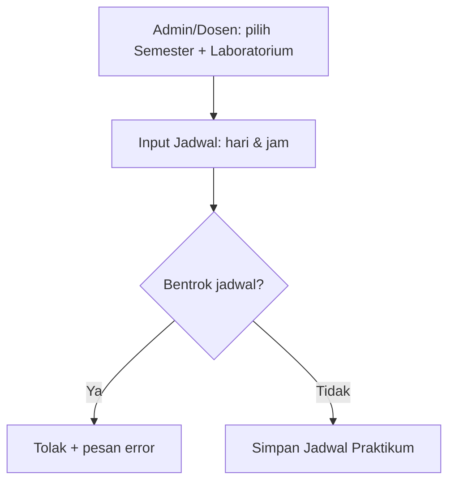
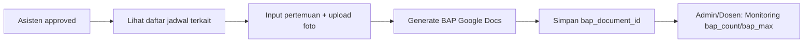
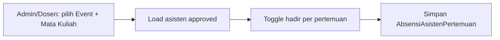
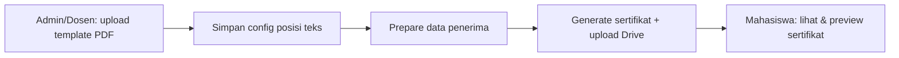
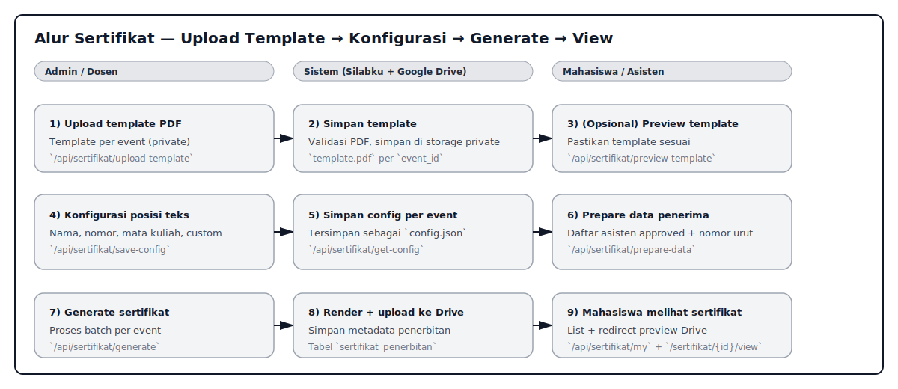
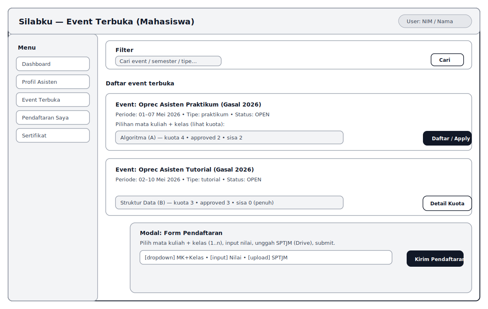
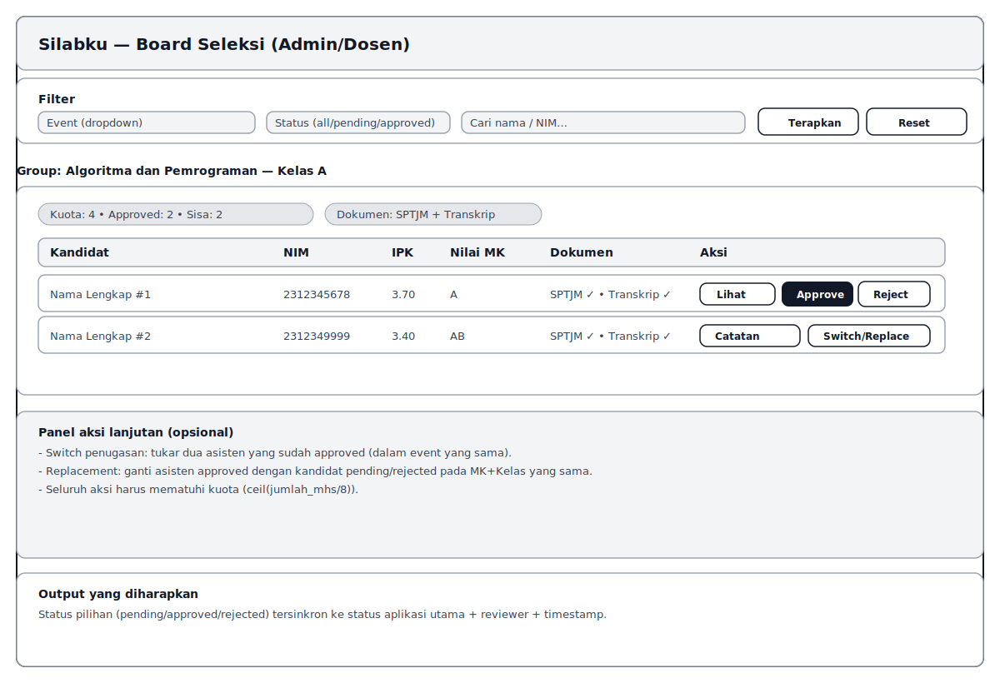
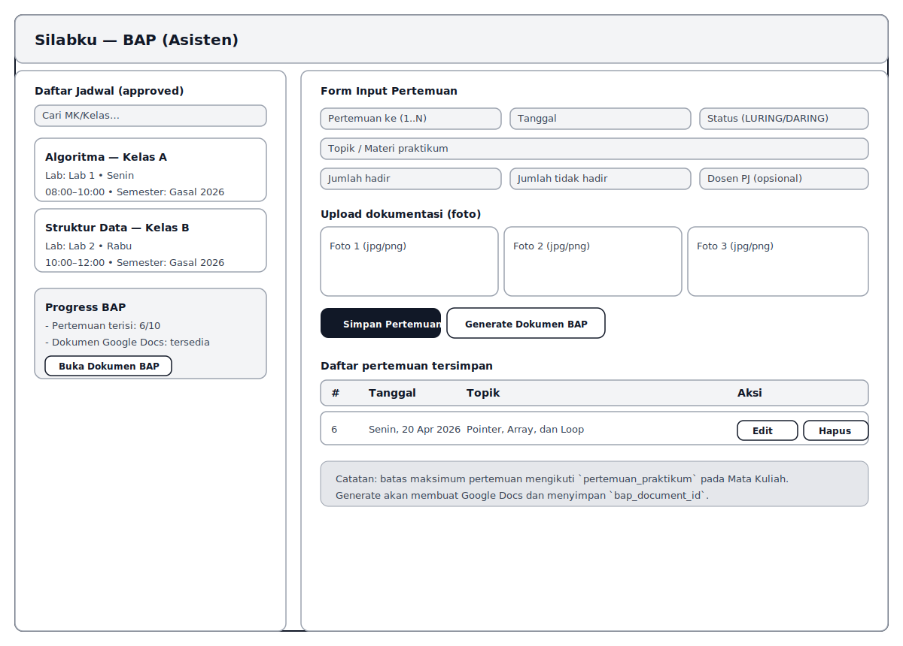

# Dokumen Pendukung: Identifikasi Kebutuhan Sistem (Silabku)

Tanggal penyusunan: 27 April 2026  
Basis penyusunan: implementasi aktual pada repo `silabku` (route, controller, migration, dan halaman Inertia/React).

## 1) Tujuan

Dokumen ini menjadi artefak pendukung tahap **“Mengidentifikasi kebutuhan fitur sistem”** untuk keperluan laporan/dokumentasi. Isi dokumen difokuskan pada:

- daftar kebutuhan fungsional & non-fungsional yang *terukur* (punya ID dan kriteria penerimaan),
- alur proses bisnis utama (as-is/to-be secara ringkas),
- prototype/wireframe sederhana layar kunci,
- matriks keterlacakan (kebutuhan → endpoint/halaman) sebagai bukti objektif.

## 2) Ruang lingkup sistem (berdasarkan project)

Silabku pada repo ini mencakup modul-modul berikut:

1. **Master Data Akademik**
   - Semester, Mata Kuliah, Kelas, Laboratorium.
2. **Oprec/Rekrutmen Asisten**
   - Admin membuat event rekrutmen dan menentukan mata kuliah + kelas dalam event.
   - Mahasiswa melengkapi profil + dokumen (Transkrip & KTM) lalu mendaftar.
3. **Seleksi & Database Asisten**
   - Admin/Dosen melakukan review/approval per pilihan mata kuliah.
   - Database asisten yang disetujui dapat dicari, difilter, dan dimonitor.
4. **Jadwal Praktikum**
   - Pengelolaan jadwal per laboratorium dan semester, termasuk validasi bentrok waktu.
5. **BAP (Berita Acara Praktikum)**
   - Asisten mengisi pertemuan, unggah foto, generate dokumen Google Docs, dan admin/dosen memonitor progress.
6. **Absensi Asisten**
   - Admin/dosen mengisi grid absensi per pertemuan untuk asisten yang approved.
7. **Penerbitan Sertifikat**
   - Admin/dosen upload template PDF, konfigurasi posisi teks, generate sertifikat dan menyajikan link view.

> Catatan: dokumen ini tidak mengklaim kebutuhan organisasi di luar yang tampak dari implementasi. Jika ada kebutuhan organisasi tambahan, gunakan Lampiran Template Wawancara pada bagian akhir.

## 3) Stakeholder, aktor, dan hak akses

### 3.1 Aktor

- **Mahasiswa/User (role: `user`)**
  - melengkapi profil asisten (biodata + upload dokumen),
  - melihat event terbuka, mendaftar, melihat status,
  - mengakses jadwal yang relevan (setelah approved),
  - membuat/men-generate BAP,
  - melihat sertifikat miliknya.

- **Admin/Koordinator (role: `admin`)**
  - kelola master data (semester, matkul, kelas, laboratorium),
  - kelola event rekrutmen,
  - melakukan seleksi, switch, dan replacement penugasan asisten,
  - monitoring BAP, absensi asisten,
  - penerbitan sertifikat dan melihat semua data sertifikat.

- **Dosen/Reviewer (role: `dosen`)**
  - melakukan seleksi dan monitoring (setara admin pada area seleksi),
  - mengakses dokumen pendukung pendaftar (SPTJM, transkrip),
  - monitoring BAP, absensi, dan sertifikat.

### 3.2 Hak akses (ringkas)

- Halaman web/Inertia dilindungi `auth` + `verified`, dengan pembatasan `role:*` pada halaman tertentu.
- API dilindungi `auth:sanctum` dan sebagian endpoint dibatasi `role:admin,dosen`.

## 4) Daftar kebutuhan fungsional (Functional Requirements / FR)

Format:
- **ID**: FR-XXX-##  
- **Deskripsi**: ringkas dan jelas  
- **Kriteria penerimaan**: indikator terukur (Given/When/Then)  
- **Bukti implementasi**: endpoint/halaman yang relevan pada project

### 4.1 Autentikasi & otorisasi

- **FR-AUTH-01 – Login & akses area terproteksi**
  - Kriteria penerimaan: user yang belum login tidak dapat mengakses halaman selain landing.
  - Bukti implementasi: `routes/web.php` (group `auth` + `verified`), `routes/auth.php`.

- **FR-AUTH-02 – Pembatasan akses berbasis role**
  - Kriteria penerimaan: user dengan role di luar daftar tidak bisa mengakses halaman/endpoint role-restricted.
  - Bukti implementasi: middleware `role:*` pada `routes/web.php` dan `routes/api.php`.

### 4.2 Profil asisten (Mahasiswa)

- **FR-PRO-01 – CRUD profil asisten**
  - Kriteria penerimaan:
    - Given user login, When membuka profil, Then sistem menampilkan data profil yang tersimpan.
    - When user submit perubahan, Then sistem memvalidasi field wajib dan menyimpan.
  - Bukti implementasi: `GET /api/profile`, `POST /api/profile` (`ProfileController`).

- **FR-PRO-02 – Upload dokumen Transkrip & KTM ke Google Drive**
  - Kriteria penerimaan:
    - When user upload transkrip/KTM dengan format valid, Then file tersimpan di disk `google` dan id tersimpan di profile.
    - When file sudah ada, user boleh upload ulang (mengganti file lama).
  - Bukti implementasi: `ProfileController::update()`, `GET /profil/transkrip`, `GET /profil/ktm`.

### 4.3 Master data

- **FR-MST-01 – Kelola semester (admin)**
  - Kriteria penerimaan: admin dapat list/search, tambah, ubah, hapus semester.
  - Bukti implementasi: `Route::apiResource('/semesters', SemesterController::class)`.

- **FR-MST-02 – Kelola mata kuliah (admin)**
  - Kriteria penerimaan: admin dapat list/search, tambah, ubah, hapus mata kuliah, termasuk `pertemuan_praktikum`.
  - Bukti implementasi: `GET /api/mata-kuliah/all`, `Route::apiResource('/mata-kuliah', MataKuliahController::class)`.

- **FR-MST-03 – Kelola kelas (admin)**
  - Kriteria penerimaan: admin dapat list/search/filter per mata kuliah, tambah, ubah, hapus kelas, serta melihat `kuota_asisten = ceil(jumlah_mhs/8)`.
  - Bukti implementasi: `Route::apiResource('/kelas', KelasController::class)`, `GET /api/kelas/all`.

- **FR-MST-04 – Kelola laboratorium (admin)**
  - Kriteria penerimaan: admin dapat list/search, tambah, ubah, hapus laboratorium.
  - Bukti implementasi: `Route::apiResource('/laboratorium', LaboratoriumController::class)`, `GET /api/laboratorium/all`.

### 4.4 Event rekrutmen (Oprec)

- **FR-EVT-01 – Admin membuat & mengelola event**
  - Kriteria penerimaan:
    - When admin membuat event, Then event tersimpan dengan atribut (nama, tipe, semester, periode buka/tutup, deskripsi).
    - Event dapat diubah dan dihapus (dengan validasi tertentu).
  - Bukti implementasi: `Route::apiResource('/events', EventController::class)`.

- **FR-EVT-02 – Admin menetapkan mata kuliah + kelas dalam event**
  - Kriteria penerimaan:
    - When event dibuat/diupdate, admin dapat menambahkan daftar pasangan (mata_kuliah_id, kelas_id).
    - Penghapusan pasangan ditolak jika masih ada asisten terpilih (approved) pada pasangan tersebut.
  - Bukti implementasi: `EventController::store()`, `EventController::update()`.

- **FR-EVT-03 – Admin membuka/menutup pendaftaran event**
  - Kriteria penerimaan: When admin toggle, Then `is_open` berubah dan event muncul/hilang dari daftar event terbuka mahasiswa.
  - Bukti implementasi: `POST /api/events/{event}/toggle-open`.

### 4.5 Pendaftaran (Mahasiswa)

- **FR-APP-01 – Mahasiswa melihat event terbuka + kuota per mata kuliah**
  - Kriteria penerimaan: sistem menampilkan event `is_open = true` dengan informasi kuota, jumlah approved, dan sisa slot per mata kuliah+kelas.
  - Bukti implementasi: `GET /api/applications/open-events` (`ApplicationController::openEvents()`).

- **FR-APP-02 – Mahasiswa mendaftar ke event per pilihan mata kuliah**
  - Kriteria penerimaan:
    - When submit pilihan, Then sistem membuat atau memperbarui `application` dan `application_mata_kuliah`.
    - Sistem menolak duplikasi pendaftaran untuk pilihan yang sama.
  - Bukti implementasi: `POST /api/applications/apply` (`ApplicationController::apply()`).

- **FR-APP-03 – Mahasiswa melihat riwayat/status pendaftaran**
  - Kriteria penerimaan: When membuka halaman riwayat, Then tampil daftar pendaftaran + reviewer + status per pilihan.
  - Bukti implementasi: `GET /api/applications/my` (`ApplicationController::myApplications()`).

### 4.6 Seleksi (Admin/Dosen)

- **FR-SEL-01 – Board seleksi per mata kuliah+kelas**
  - Kriteria penerimaan:
    - sistem mengelompokkan kandidat per `event_mata_kuliah_id`,
    - menampilkan kuota, jumlah approved, sisa slot,
    - menyediakan kandidat beserta status, nilai, dan kelengkapan dokumen.
  - Bukti implementasi: `GET /api/applications/selection-board` (`ApplicationController::selectionBoard()`).

- **FR-SEL-02 – Approve/Reject per pilihan mata kuliah**
  - Kriteria penerimaan:
    - When approve, Then status pilihan menjadi `approved` dan kuota tidak boleh terlampaui.
    - When reject, Then status pilihan menjadi `rejected`.
    - Status aplikasi utama sinkron mengikuti status pilihan.
  - Bukti implementasi: `POST /api/applications/choices/{choice}/approve`, `POST /api/applications/choices/{choice}/reject`.

- **FR-SEL-03 – Reviewer dapat melihat dokumen SPTJM & Transkrip**
  - Kriteria penerimaan: hanya admin/dosen yang dapat membuka dokumen dari Google Drive.
  - Bukti implementasi: `GET /seleksi/choices/{choice}/sptjm`, `GET /seleksi/choices/{choice}/transkrip`.

- **FR-SEL-04 – Switch & replacement penugasan asisten**
  - Kriteria penerimaan:
    - Switch hanya untuk penugasan `approved` dan dalam event yang sama.
    - Replacement mengganti asisten approved dengan kandidat non-approved pada pasangan matkul+kelas yang sama.
  - Bukti implementasi: `switchOptions`, `switchChoice`, `replacementCandidates`, `replaceApprovedChoice` (`ApplicationController`).

### 4.7 Database asisten (Admin/Dosen)

- **FR-DBA-01 – Database semua asisten approved**
  - Kriteria penerimaan: dapat difilter (event, semester, tipe), dapat search nama/NIM, hasil paginated.
  - Bukti implementasi: `GET /api/database/asisten` (`ApplicationController::database()`).

- **FR-DBA-02 – Database asisten unik (per user)**
  - Kriteria penerimaan: menampilkan user unik + total event + daftar assignment approved.
  - Bukti implementasi: `GET /api/database/asisten-unik` (`ApplicationController::databaseUnique()`).

### 4.8 Jadwal praktikum

- **FR-JDW-01 – Melihat jadwal per laboratorium + semester**
  - Kriteria penerimaan: sistem menampilkan jadwal yang sesuai parameter `laboratorium_id` dan `semester_id`.
  - Bukti implementasi: `GET /api/jadwal-praktikum` (`JadwalPraktikumController::index()`).

- **FR-JDW-02 – Kelola jadwal (admin/dosen) + validasi bentrok**
  - Kriteria penerimaan:
    - When membuat/mengubah jadwal, Then sistem menolak jika jam bentrok pada hari yang sama, lab yang sama, semester yang sama.
  - Bukti implementasi: `POST/PUT/DELETE /api/jadwal-praktikum/*` (`JadwalPraktikumController`).

### 4.9 BAP (Berita Acara Praktikum)

- **FR-BAP-01 – Asisten melihat kelas/jadwal yang relevan (approved)**
  - Kriteria penerimaan: user yang approved melihat daftar jadwal yang sesuai mata kuliah+kelas yang disetujui.
  - Bukti implementasi: halaman `GET /bap` (`BapController::index()`).

- **FR-BAP-02 – Input data pertemuan + upload foto**
  - Kriteria penerimaan: validasi pertemuan (min 1, max sesuai `pertemuan_praktikum`), simpan data + upload foto (jpg/jpeg/png).
  - Bukti implementasi: `POST /bap/store` (`BapController::store()`).

- **FR-BAP-03 – Generate dokumen BAP Google Docs**
  - Kriteria penerimaan:
    - sistem menggandakan template Docs,
    - mengisi token/placeholder, membuat tabel dinamis, menyisipkan foto,
    - menyimpan `bap_document_id` ke `application_mata_kuliah`.
  - Bukti implementasi: `POST /bap/generate` (`BapController::generate()`), migrasi `add_bap_document_id_to_application_mata_kuliah_table`.

- **FR-BAP-04 – Monitoring BAP (admin/dosen)**
  - Kriteria penerimaan: menampilkan progress `bap_count/bap_max` per asisten+assignment.
  - Bukti implementasi: `GET /api/database/bap-monitoring` (`BapController::monitoring()`).

- **FR-BAP-05 – Redirect/open dokumen BAP**
  - Kriteria penerimaan: user pemilik (atau admin/dosen) dapat membuka dokumen BAP via redirect.
  - Bukti implementasi: `GET /bap/{id}/redirect-doc` (`BapController::redirectDoc()`).

### 4.10 Absensi asisten (admin/dosen)

- **FR-ABS-01 – Lihat grid absensi per event + mata kuliah**
  - Kriteria penerimaan: menampilkan daftar asisten approved dan kolom pertemuan sesuai `pertemuan_praktikum`.
  - Bukti implementasi: `GET /api/database/absensi-asisten` (`AbsensiAsistenController::index()`).

- **FR-ABS-02 – Toggle absensi per pertemuan**
  - Kriteria penerimaan: When toggle hadir true/false, Then record dibuat/dihapus, dibatasi maksimum pertemuan.
  - Bukti implementasi: `POST /api/database/absensi-asisten` (`AbsensiAsistenController::setAttendance()`).

### 4.11 Sertifikat

- **FR-SER-01 – Upload & preview template sertifikat (PDF)**
  - Kriteria penerimaan: template disimpan (private) per event dan dapat di-preview.
  - Bukti implementasi: `POST /api/sertifikat/upload-template`, `GET /api/sertifikat/preview-template`.

- **FR-SER-02 – Konfigurasi posisi teks (nama/nomor/matkul/custom)**
  - Kriteria penerimaan: konfigurasi tersimpan per event dan dapat dimuat kembali.
  - Bukti implementasi: `POST /api/sertifikat/save-config`, `GET /api/sertifikat/get-config`.

- **FR-SER-03 – Prepare data penerima sertifikat**
  - Kriteria penerimaan: sistem menyiapkan daftar penerima (asisten approved) dan membentuk nomor sertifikat berurutan.
  - Bukti implementasi: `GET /api/sertifikat/prepare-data`.

- **FR-SER-04 – Generate sertifikat & simpan data penerbitan**
  - Kriteria penerimaan: sistem membuat file sertifikat (berdasarkan template+config), mengunggah ke Google Drive, dan menyimpan data penerbitan.
  - Bukti implementasi: `POST /api/sertifikat/generate`, tabel `sertifikat_penerbitan`.

- **FR-SER-05 – Mahasiswa melihat sertifikatnya**
  - Kriteria penerimaan: user dapat melihat daftar sertifikatnya dan membuka file via link Google Drive.
  - Bukti implementasi: `GET /api/sertifikat/my`, `GET /sertifikat/{id}/view`.

## 5) Kebutuhan non-fungsional (Non-Functional Requirements / NFR)

- **NFR-SEC-01 – Keamanan akses**
  - Semua endpoint bisnis wajib berada di belakang autentikasi (`auth:sanctum`) dan/atau role middleware sesuai kebutuhan.

- **NFR-SEC-02 – Validasi input**
  - Setiap endpoint create/update wajib memvalidasi field wajib dan tipe data (contoh: bentrok jadwal, batas pertemuan, format file).

- **NFR-REL-01 – Konsistensi data seleksi**
  - Status `application` harus sinkron dengan status per `application_mata_kuliah` (pending/approved/rejected).

- **NFR-PERF-01 – Pagination & pencarian**
  - List data besar (event, aplikasi, database, absensi) menggunakan pagination dan opsi search/filter.

- **NFR-INT-01 – Integrasi Google Drive/Docs**
  - Sistem mendukung upload dokumen (transkrip/KTM/SPTJM/foto) dan pembuatan dokumen (BAP/sertifikat) ke Google Drive/Docs.

- **NFR-AUD-01 – Jejak review**
  - Sistem menyimpan `reviewed_by` dan `reviewed_at` saat status aplikasi tersinkron.

## 6) Flow proses bisnis (ringkas)

### 6.1 Rekrutmen asisten (Oprec → Seleksi → Database)

```mermaid
flowchart LR
  A[Admin: siapkan master data] --> B[Admin: buat Event + MK/Kelas]
  B --> C[Admin: buka pendaftaran]
  C --> D[Mahasiswa: lengkapi profil + upload dokumen]
  D --> E[Mahasiswa: daftar (pilih MK/Kelas + upload SPTJM)]
  E --> F[Admin/Dosen: seleksi per MK/Kelas]
  F -->|approve| G[Asisten: status approved]
  F -->|reject| H[Mahasiswa: status rejected/pending]
  G --> I[Database Asisten Approved]
```

### 6.2 Pengelolaan jadwal praktikum



### 6.3 BAP (Asisten) + Monitoring (Admin/Dosen)



### 6.4 Absensi asisten (Admin/Dosen)



### 6.5 Sertifikat (Admin/Dosen → Mahasiswa)



Versi SVG (siap ditempel ke laporan):



## 7) Prototype/Wireframe (low fidelity)

Wireframe berikut bersifat **sketsa** untuk memperkuat tahap identifikasi kebutuhan (bukan desain final).

### 7.1 Wireframe: Event Terbuka & Pendaftaran



### 7.2 Wireframe: Board Seleksi (Admin/Dosen)



### 7.3 Wireframe: Form Input BAP & Generate Docs



## 8) Matriks keterlacakan (kebutuhan → bukti implementasi)

Tabel ringkas berikut bisa dipakai sebagai “bukti objektif” bahwa kebutuhan memang diturunkan dari implementasi.

| Kebutuhan | Endpoint/Route utama (contoh) | Controller |
|---|---|---|
| FR-PRO-01/02 | `GET/POST /api/profile` | `ProfileController` |
| FR-MST-01 | `apiResource /api/semesters` | `SemesterController` |
| FR-MST-02 | `apiResource /api/mata-kuliah`, `GET /api/mata-kuliah/all` | `MataKuliahController` |
| FR-MST-03 | `apiResource /api/kelas`, `GET /api/kelas/all` | `KelasController` |
| FR-MST-04 | `apiResource /api/laboratorium`, `GET /api/laboratorium/all` | `LaboratoriumController` |
| FR-EVT-01/02/03 | `apiResource /api/events`, `POST /api/events/{event}/toggle-open` | `EventController` |
| FR-APP-01/02/03 | `GET /api/applications/open-events`, `POST /api/applications/apply`, `GET /api/applications/my` | `ApplicationController` |
| FR-SEL-01/02/03/04 | `GET /api/applications/selection-board`, `POST approve/reject`, `GET dokumen` | `ApplicationController` |
| FR-DBA-01/02 | `GET /api/database/asisten`, `GET /api/database/asisten-unik` | `ApplicationController` |
| FR-JDW-01/02 | `apiResource /api/jadwal-praktikum` | `JadwalPraktikumController` |
| FR-BAP-01..05 | `GET/POST /bap/*`, `GET /api/database/bap-monitoring` | `BapController` |
| FR-ABS-01/02 | `GET/POST /api/database/absensi-asisten` | `AbsensiAsistenController` |
| FR-SER-01..05 | `POST /api/sertifikat/*`, `GET /sertifikat/{id}/view` | `SertifikatController` |

## 9) Lampiran – Template catatan wawancara/diskusi (opsional)

Gunakan template berikut jika laporan membutuhkan bukti “hasil diskusi pengguna”.

**A. Identitas**
- Tanggal:
- Narasumber:
  - Koordinator Lab:
  - Dosen PJ:
  - Asisten Praktikum:
  - Mahasiswa:
- Media: (tatap muka / WA / Zoom / lainnya)

**B. Pain points (sebelum sistem)**
- Rekrutmen & seleksi:
- Pengelolaan dokumen (transkrip/KTM/SPTJM):
- Jadwal praktikum:
- BAP dan dokumentasi pertemuan:
- Absensi asisten:
- Sertifikat:

**C. Kebutuhan (to-be)**
- Fitur wajib:
- Fitur nice-to-have:
- Aturan bisnis (quota, validasi bentrok, batas pertemuan, dsb):
- Laporan/monitoring yang dibutuhkan:

**D. Kesepakatan & follow-up**
- Prioritas fitur:
- Risiko/constraint:
- Tindak lanjut:
